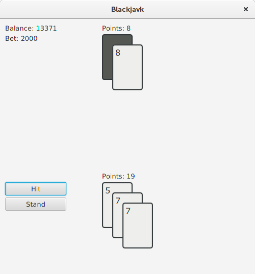

# Blackjavk

## Description

A simple implementation of the Blackjack game in Java.  
This repo is pretty much just a demo to show why the current specification of the `Integer` class is stupid (it doesn't work properly with pointers, it behaves like primitive `int`), but you can just play the game too, it mostly works fine.

## Dependencies

- Java 8 (tested on OpenJDK 1.8.0_111)
- JavaFX (tested on OpenJFX 8u60-b27-4)

## Known bugs
- Split mode is kinda buggy, but it probably doesn't change the points you win
  or lose.
